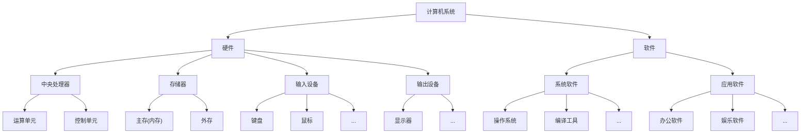
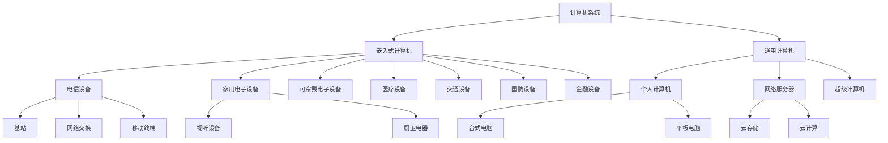

## 计算机系统概述

**计算机系统 = 硬件 + 软件**



系统分类维度：



## 计算机硬件

### 计算机硬件组成

冯·诺依曼体系结构是现代计算机的基础，由数学家约翰·冯·诺依曼于1945年提出。它的核心思想可以概括为一句话：

> **程序和数据都存储在同一个存储器中，计算机按照存储的程序顺序自动执行指令。**

**冯·诺依曼体系结构的五大部件**

| 部件     | 英文   | 功能                         |
| -------- | ------ | ---------------------------- |
| 运算器   | ALU    | 完成算术运算和逻辑运算       |
| 控制器   | CU     | 控制指令执行、协调各部件工作 |
| 存储器   | Memory | 存放程序和数据               |
| 输入设备 | Input  | 将外部信息送入计算机         |
| 输出设备 | Output | 将计算结果送出计算机         |

其中，**运算器 + 控制器 = 中央处理器（CPU）**。

**工作流程（简化）**

```
取指令 → 分析指令 → 执行指令 → 取下一条指令 → ...
```

具体步骤：

1. **取指令**：控制器从存储器中取出指令
2. **分析指令**：译码，判断要做什么操作
3. **执行指令**：运算器或其他部件完成操作
4. **写回结果**：将结果写回存储器或寄存器
5. **重复以上步骤**，直到程序结束

**冯·诺依曼体系结构 = 存储程序 + 程序控制 + 五大部件（运算器、控制器、存储器、输入、输出）。**

核心是：**程序和数据都存在存储器里，计算机自动按顺序取指令并执行。**

现代计算机里这些部件已经高度集成：

- **运算器+控制器 → CPU**（还包含多级缓存、通信总线等）
- **输入设备+输出设备 → 总线/接口/外部设备**

### 处理器

**指令集分类**

| 指令集类型 | 英文缩写 | 代表产品              | 特点/趋势                               |
| ---------- | -------- | --------------------- | --------------------------------------- |
| 复杂指令集 | CISC     | Intel、AMD 的 x86 CPU | 因历史原因仍存在                        |
| 精简指令集 | RISC     | ARM、Power            | 已成为发展趋势，后期指令集几乎均为 RISC |

**专用处理器芯片**

| 类型                 | 英文缩写 | 特点                                                         | 应用领域           |
| -------------------- | -------- | ------------------------------------------------------------ | ------------------ |
| 图形处理器           | GPU      | 数百或数千内核，优化并行计算                                 | 深度学习、机器学习 |
| 信号处理器           | DSP      | 饱和算法处理溢出，乘积累加提高矩阵运算效率，专用傅里叶变换指令 | 高速信号采集设备   |
| 现场可编程逻辑门阵列 | FPGA     | 可编程逻辑                                                   | 专用目的处理       |

市场占有率和知名度较高的产品包括：**龙芯、飞腾、申威、兆芯、国微、国芯、华睿、翔腾微、景嘉微**。

### 存储器

**存储器分层体系**

| 层次         | 位置                                | 典型结构 | 容量范围       | 特点                               |
| ------------ | ----------------------------------- | -------- | -------------- | ---------------------------------- |
| 片上缓存     | 处理器核心内直接集成                | SRAM     | 16KB～512KB    | 速度最快，容量最小，可分一级或二级 |
| 片外缓存     | 处理器核心外，经交换互联开关访问    | SRAM     | 256KB～4MB     | 称 L2/L3 Cache 或平台 Cache        |
| 主存（内存） | 独立部件/芯片，通过总线与处理器连接 | DRAM     | 数百MB～数十GB | 需不断充电维持数据                 |
| 外存         | 磁带、磁盘、光盘、Flash 等          | 多种介质 | MB～TB 级      | 速度慢、容量大、掉电可保持         |

存储器按与处理器距离分 4 层——片上缓存、片外缓存、主存、外存；越靠近处理器越快越小，越远越慢越大，外存掉电可保持数据。

**外存介质保存年限**

| 介质  | 保存年限     |
| ----- | ------------ |
| Flash | 约10年       |
| 光盘  | 数年至数十年 |
| 磁盘  | 10年以上     |
| 磁带  | 30年以上     |

### 总线

**分类（按位置）**

| 类型     | 别名               | 连接范围                                 | 说明                                                  |
| -------- | ------------------ | ---------------------------------------- | ----------------------------------------------------- |
| 内总线   | 片上总线、片内总线 | 各类芯片内部互连                         | 芯片内部使用                                          |
| 系统总线 | —                  | CPU、主存、I/O 接口                      | 狭义指 CPU 与主存、通信桥连接的总线；广义还含局部总线 |
| 外部总线 | 通信总线           | 计算机板与外部设备之间，或计算机系统之间 | 用于系统间互联                                        |

> 总线之间通过**桥（Bridge）**连接，桥是一种特殊外设，主要实现总线协议间的转换。

**常见总线类型**

| 分类     | 常见总线                                        |
| -------- | ----------------------------------------------- |
| 并行总线 | PCI、PCIe、ATA（IDE）                           |
| 串行总线 | USB、SATA、CAN、RS-232、RS-485、RapidIO、以太网 |

**专业领域总线**

| 领域     | 总线                                        |
| -------- | ------------------------------------------- |
| 航空     | ARINC429、ARINC659、ARINC664、MIL-STD-1553B |
| 工业控制 | CAN、IEEE1394、PCI、PCIe、VME               |

**一句话总结：** 总线按位置分内总线、系统总线、外部总线；靠桥连接转换；**性能看带宽、QoS、时延、抖动**；常见有并行和串行两类，各专业领域还有专用总线。

### 接口、外部设备

| 分类           | 常见接口                                 |
| -------------- | ---------------------------------------- |
| 显示类         | HDMI、DVI 等                             |
| 音频输入输出类 | TRS、RCA、XLR 等                         |
| 网络类         | RJ45、FC 等                              |
| 通用类         | PS/2、USB、SATA、LPT 打印接口、RS-232 等 |
| 非标准接口     | 离散量接口、A/D 转换接口等（随需求设计） |

> 一种总线可能有多种接口：以太网可通过 RJ-45 或同轴电缆连接；PCIe 有多种形态接口。

**外部设备定义：** 外部设备也称外围设备，是计算机的非必要设备，包括所有输入输出设备以及部分存储设备（外存）。

| 应用场景                 | 常见外部设备                                                 |
| ------------------------ | ------------------------------------------------------------ |
| 通用计算机               | 键盘、鼠标、显示器、扫描仪、摄像头、麦克风、打印机、光驱、网卡、存储卡/盘 |
| 移动和穿戴设备           | 加速计、GPS、陀螺仪、感光设备、指纹识别设备                  |
| 工业控制、航空航天、医疗 | 测温仪、测速仪、轨迹球、操作面板、红外/NFC 感应设备、场强测量设备、功率驱动装置、机械臂、液压装置、油门杆、驾驶杆 |

> 各型外部设备种类多样，但都通过**接口**与计算机主体连接，并通过指令、数据实现预期功能。

**一句话总结：** 接口是同一计算机不同功能层之间的通信规则，分显示、音频、网络、通用和非标准等类；外部设备是计算机的非必要设备，通过接口与主机连接实现功能。

## 计算机软件

待续